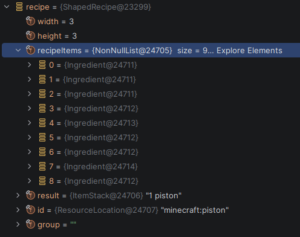

# Recipe Scraping

## Extracting Recipe JSON

So far I've gathered that JEI exposes a RecipeManager that can be accessed by a mod acting as a JEI plugin.

This provides a way to get a list of `RecipeType` objects used in JEI. 

It also provides `createRecipeLookup(recipe_type)` which returns a `IRecipeLookup<R>`. This is some kind of storage for the list of all recipes for a particular type.

Unfortunately there are multiple recipe types, and many mods add their own types. These types have their own classes, and store data a little differently.

I've found that I can inspect the properties of each of these with the IntelliJ debugger:




Each Recipe has many unique properties that later provide information to JEI on how to display it in their UI.

Since I'm not entirely sure how to properly extract the information from each recipe in a generic way, I've built a RecipeScraper that extracts the fields from it. That's in [RecipeScraper.java](../src/main/java/com/example/examplemod/RecipeScraper.java).

## Slot Extraction

Since starting this scraper, I've discovered that JEI uses something called "slots" to define where items go in the crafting UI, and whether they are considered Inputs or Outputs in the recipe. They don't provide a way of easily extracting them, but nature finds a way.

Normally when JEI renders a recipe, it grabs the `IRecipeLayoutBuilder` for the recipe type, and use `IRecipeCategory.setRecipe()` which takes an `IRecipeLayoutBuilder` and a `Recipe` as inputs.

It then calls `addSlot()` on the builder itself to get a new slot. This takes the role (INPUT/OUTPUT) and the x, y coordinates of the slot for placement. (not in pixels!)

It then calls and `addIngredients()`, `addItemStack()` to the slot to attach the items in the slot.

Now if I were to create a custom Builder class [CapturingLayoutBuilder.java](../src/main/java/com/example/examplemod/CapturingLayoutBuilder.java) I could overwrite how setRecipe works to provide me with the slots created in the process.

Additionally I could create a custom slot class [CapturedSlot.java](../src/main/java/com/example/examplemod/CapturedSlot.java) which similarly overwrites all the `addIngredients()` and other similar methods. 

Then I could write a simple function in [SlotExtractor.java](../src/main/java/com/example/examplemod/SlotExtractor.java) that takes a `Recipe` and `RecipeCategory` and returns the slots for that recipe, in the form of my CapturedSlots.

I've done all this, and added them to the existing recipe scraper. It turns out slots contain most of the information needed in a recipe. X inputs, Y outputs.

Given a JSON file containing recipes with slots, I could also create an index for searching items by input/output. Similarly to how JEI handles navigating their UI.

## Ingredient Options

JEI supports the ability to view a recipe with multiple options for a given input slot. 

For example, the Crafting Table can be crafting by creating a 2x2 square of any type of wood planks.

JEI handles this by having each Slot store an array of ItemStacks. Each containing a different item option. For example:

```json
{
  "role": "INPUT",
  "x": 1,
  "y": 1,
  "items": [
    {
      "uid": "minecraft__oak_planks",
      "damage": 0,
      "item": "oak_planks",
      "maxDamage": 0,
      "_type": "ItemStack",
      "name": "Oak Planks",
      "count": 1,
      "resourceLocation": "minecraft:oak_planks"
    },
    {
      "uid": "minecraft__spruce_planks",
      "damage": 0,
      "item": "spruce_planks",
      "maxDamage": 0,
      "_type": "ItemStack",
      "name": "Spruce Planks",
      "count": 1,
      "resourceLocation": "minecraft:spruce_planks"
    }
  ]
}
```

This slot for example would alternate between a single oak planks and spruce planks.

## NBT Data

Previously I've been using the `ResourceLocation` of an item to uniquely identify it. 

This looks like `minecraft:cobblestone` for Cobblestone. Unfortunately, this does not distinguish items that differ by NBT.

NBT is Minecraft's way of storing metadata about items and blocks such as enchantments, damage, potion effects, and much more.

My scraper picks this up from ItemStacks as a property named "capNBT", but I find most of the useful information is found in the tags, damage, and count.

```json
{
  "uid": "minecraft__wooden_sword__e3fb60131af89a6e9f373be95e8a4fc5",
  "damage": 29,
  "item": "wooden_sword",
  "capNBT": {
    "Count": "1b",
    "id": "minecraft:wooden_sword",
    "tag": {
      "Damage": 29
    }
  },
  "maxDamage": 59,
  "_type": "ItemStack",
  "name": "Wooden Sword",
  "count": 1,
  "tag": {
    "Damage": 29
  },
  "resourceLocation": "minecraft:wooden_sword"
}
```

Interestingly it contains the ResourceLocation inside as an `id` which isn't located anywhere else on the ItemStack. Yoink.

Since many potions share the same ResourceLocation, it's not enough to be used as a unique identifier.

I noticed [IconExporter](https://www.curseforge.com/minecraft/mc-mods/iconexporter) had an elegant solution to this problem. It exported items with the ResourceLocation + an MD5 hash of the tag JSON.

```
minecraft__potion__0__d4272645c61d50de18ce399e7093de8f.png
minecraft__potion__0__d4272645c61d50de18ce399e7093de8f.txt
```

Since IconExporter is also a pretty nice way of exporting Icons, I decided to copy their naming convention for item unique identifiers (uids)

Unfortunately, not all the icons line up with items in

## Data Redundancy

As one might expect, a scraper that just pulls every property off every item creates a lot of redundant information. This can make the JSON bloated, which makes recipes slower to load in the UI. I'm aiming to eventually slim

### Duplicate Items in Slots

A shaped recipe such as the one to create a block of iron out of 9 iron ingots in a square, would list the entire JSON for each iron ingot 9 times. Including the Slot data. Swapping them for a uid and having a uid -> item detail lookup would be handy.

### Duplicate Ingredient Sets

If I manage to replace ItemStacks with the appropriate uid, we'd still be stuck with some duplicate sets of item options. Presumably these would resolve to some combination of tags like "minecraft:planks" to each type of plank, but I haven't figured that out yet.

Perhaps maintaining a separate list of ingredient "sets" would reduce this duplication?

### Duplicate Slot Data

There are really only so many slots in a given RecipeCategory / RecipeType.

A crafting table has 9 inputs and one output. Same role, x, y coordinates in each recipe.

Could I somehow reduce this by keeping slot data somewhere specific to the RecipeCategory?
Recipes are already stored in category-specific files as a list, so perhaps keeping a separate list of slot options might help. If I paginate the recipe lists this might be tricky.

Perhaps in a separate slot data file?

Depends what would load faster.